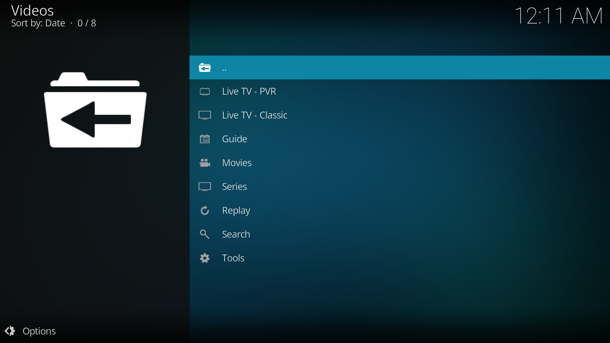

# XStream Player

A Kodi addon for Xtream Codes and M3U playlist playback with organized categories, EPG support, and PVR integration.

## Features

- **Live TV - PVR** with EPG guide and Kodi's native PVR integration
- **Live TV - Classic** with in-addon channel browsing
- **Movies** with plot info and poster art
- **Series** with season/episode tracking and watched status
- **Replay / Catchup** for channels with archive support
- **10 Profiles** with independent credentials and settings
- **Search** across Live TV, Movies, and Series
- **Favorites** with folder organization and M3U export
- **Watch History** with resume playback support
- **Parental Control** with PIN lock
- **Credentials PIN lock** to protect profile settings
- **TMDB integration** for movie metadata (optional)
- **Buffer fix** built-in — prevents streams from stopping after a few seconds
- **Auto-refresh** and data caching for fast navigation

## Screenshots

## Installation

### Install from ZIP

1. Download `plugin.video.xstream-player.zip` from the [Releases](../../releases) page
2. In Kodi, go to **Settings > Add-ons > Install from ZIP file**
3. Select the downloaded ZIP
4. PVR IPTV Simple Client will be installed automatically

## Setup

1. Open **XStream Player** from your Video Add-ons
2. Go to **Tools > Settings**
3. Under **Profiles**, enter your Xtream server URL, username, and password (or M3U URL)
4. Go back and select **Refresh List** to load your channels
5. When prompted, restart Kodi for PVR Live TV to work properly
6. After restart, open XStream Player — your Live TV, Movies, and Series are ready

> **Note:** After switching profiles, you need to use **Refresh List** to load the new profile's data.

### Live TV Modes

The main menu shows two Live TV options:

- **Live TV - PVR** — Uses Kodi's native PVR with full channel guide, zapping, and EPG. Requires a Kodi restart after first setup.
- **Live TV - Classic** — Browse and play channels directly within the addon. No restart needed.

## Settings Overview

### Profile
- **Active Profile** — Switch between up to 10 profiles, each with its own credentials
- **Lock credentials with PIN** — Protect settings access with a PIN code

### Playback & Buffer
- **Stream timeout** — How long to wait before giving up on a stream (default 15s)
- **Custom User-Agent** — Override the user-agent for streams that require it
- **Enable buffer** — Optimizes Kodi's buffer for stable IPTV playback (enabled by default). Prevents streams from stopping after a few seconds.
- **Buffer size** — Amount of stream data to keep in memory (default 100 MB)
- **Read factor** — How fast to fill the buffer relative to playback speed (default 20x)

### EPG & Guide
- **Auto-detect EPG from Xtream** — Automatically fetch the TV guide from your provider
- **Show EPG info in Live TV** — Display current/next program info on channel listings
- **EPG language priority** — Preferred language for guide data (e.g. `en`, `fr`)
- **EPG refresh interval** — How often to update the guide (default every 4 hours)
- **EPG timezone offset** — Adjust if program times are wrong
- **Replay days back** — How many days of catchup/replay to show (default 7)

### PVR & Data
- **Auto-sync Live TV to PVR** — Automatically update PVR channels on refresh
- **Auto-refresh data** — Automatically refresh channel data at set intervals
- **Auto-refresh interval** — How often to refresh (12h, 24h, 48h, or Never)
- **Pre-fetch all data on startup** — Cache everything when you first open the addon

### Appearance
- **Default sort order** — Sort channels by provider order or A-Z
- **TMDB metadata** — Fetch movie plots and posters from TMDB (requires free API key from themoviedb.org)

### Parental Control
- **Enable parental control** — Require PIN to access Movies and Series
- **Hide adult categories** — Filter out adult content (toggle in Tools menu)

### Backup & Restore
- **Backup profiles & data** — Save your profiles and settings
- **Restore profiles & data** — Restore from a previous backup

## Requirements

- Kodi 21 (Omega) or later
- PVR IPTV Simple Client (installed automatically)

## License

MIT
