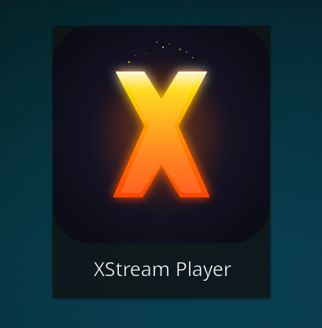
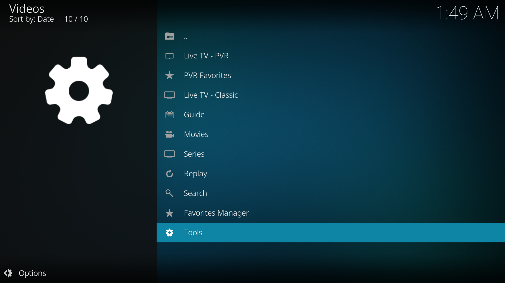
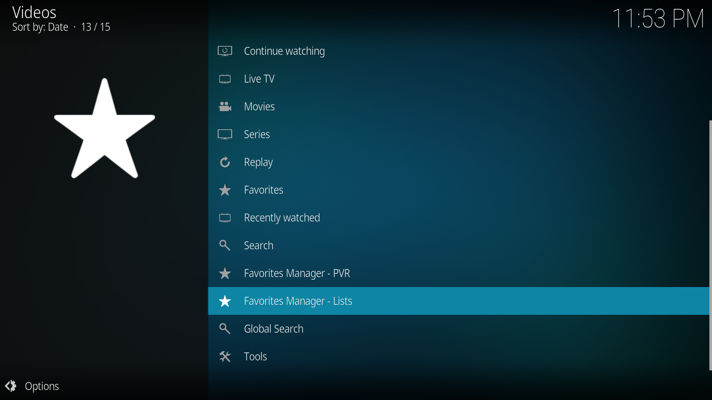
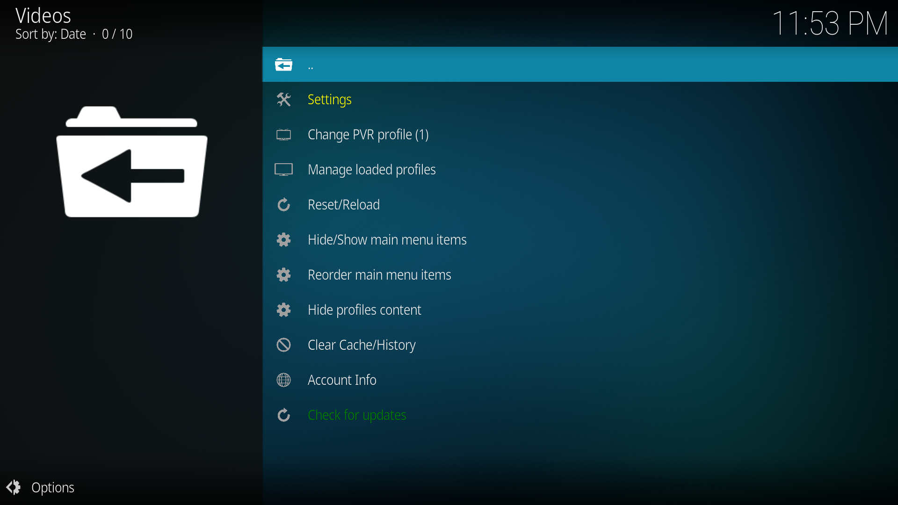

# XStream Player

A Kodi addon for Xtream Codes and M3U playlist playback with organized categories, EPG support, and PVR integration.

## Features

- **Live TV - PVR** with EPG guide and Kodi's native PVR integration
- **Live TV - Classic** with in-addon channel browsing
- **Favorites Manager - PVR** — create custom PVR favorite groups that appear in Kodi's PVR channel panel (via a dedicated PVR instance)
- **Favorites - Classic, Movies, Series** — custom favorites groups with context menu integration and M3U export
- **Movies** with plot info and poster art
- **Series** with season/episode tracking and watched status
- **Replay / Catchup** for channels with archive support
- **10 Profiles** with independent credentials, favorites, PVR favorites, hidden items, and per-profile data loading toggles
- **Manage content per profile** — hide/unhide categories or individual channels, movies, and series from within profile settings
- **Search** across Live TV, Movies, and Series
- **Watch History** with resume playback support
- **Parental Control** with PIN lock for Settings, Tools, and adult content per type (Live TV, Movies, Series)
- **Adult content filtering** with comprehensive keyword detection (works independently of PIN lock)
- **TMDB integration** for movie metadata (optional)
- **Buffer settings** built-in with configurable size and read factor
- **Subcategory hiding** for Live TV, Movies, and Series with Select All / Deselect All
- **Catchup / Replay in PVR** — watch past programs directly from the PVR guide (provider support required)
- **Per-profile caching** — each profile has its own data cache
- **Auto-refresh** and data caching for fast navigation
- **PVR keyboard shortcuts** — Left arrow opens channel list, Right arrow opens guide in fullscreen PVR

## Screenshots

|  |  |

## Installation

### Method 1: Install via File Manager (Recommended for updates)

This method allows the addon to self-update automatically.

1. In Kodi, go to **Settings > File Manager**
2. Select **Add Source**
3. Enter the URL: `https://pesicp.github.io/XStream-Player-Kodi21/releases/`
4. Enter a name: `XStream`
5. Click **OK**
6. Go to **Settings > Add-ons > Install from ZIP file**
7. Select the `XStream` source you just added
8. Click on `plugin.video.xstream-player-1.0.6.zip` (latest version)
9. The addon will install and auto-update on future launches!

### Method 2: Direct ZIP Install

1. Download the latest `plugin.video.xstream-player-*.zip` from the [releases page](https://pesicp.github.io/XStream-Player-Kodi21/releases/)
2. In Kodi, go to **Settings > Add-ons > Install from ZIP file**
3. Select the downloaded ZIP
4. PVR IPTV Simple Client will be installed automatically
---

## Auto-Updates

XStream Player includes a built-in update system. When a new version is available:

- **On startup**, you'll see a prompt: "Install Now" or "Later"
- Click **Install Now** to automatically download and install the update
- Click **Later** to skip and be reminded next time
- After installation, restart Kodi to apply the update

### Configure Update Checks

Go to **Settings > Updates** to configure:
- **Auto-check interval**: Never / On Startup / Daily / Weekly / Monthly
- **Check for Updates**: Manual check button
- **Revert to Older Version**: Downgrade to a previous version if needed
---

## Setup

1. Open **XStream Player** from your Video Add-ons
2. Go to **Tools > Settings**
3. Under **Profiles**, enter your Xtream server URL, username, and password (or M3U URL)
4. Go back and select **Refresh List** to load your channels
5. When prompted, restart Kodi for PVR Live TV to work properly
6. After restart, open XStream Player — your Live TV, Movies, and Series are ready

> **Note:** After switching profiles, you need to use **Refresh List** to load the new profile's data.
---

### Live TV Modes

The main menu shows two Live TV options:

- **Live TV - PVR** — Uses Kodi's native PVR with full channel guide, zapping, and EPG. Requires a Kodi restart after first setup.
- **Live TV - Classic** — Browse and play channels directly within the addon. No restart needed.
---

### Favorites Manager - PVR

Create custom PVR favorite groups from the main menu. Each group appears as a channel group in Kodi's PVR left panel via a dedicated second PVR instance.

- Create groups and populate them by browsing categories or searching channels
- Add entire categories or pick individual channels via multiselect
- Manage existing channels in each group (add/remove via multiselect)
- Groups appear in PVR as "★ Favorites - GroupName"
- Rename or delete groups from the context menu

### Favorites - Classic, Movies, Series

Create custom favorites groups from the main menu. Each group can hold a mix of live channels, movies, and series. Items are organized by type inside each group.

- Right-click any item anywhere (Classic, Movies, Series) to add it to a custom group
- Rename, export, or delete groups from the Favorites Manager
- Groups appear in context menus across the entire addon
---

### Per-Profile Data Separation

Each of the 10 profiles has completely independent:

- Favorites (Classic, Movies, Series groups)
- PVR Favorites groups
- Hidden categories and individual items
- Visible main menu items
- Data loading toggles (Live TV, Movies, Series)

### Data Loading Toggles

Each profile has toggles to enable/disable loading of Live TV, Movies, and Series data. When a category is disabled:

- Its data is not fetched from the server during refresh
- Its menu items are hidden from the main menu
- Guide and Replay are also hidden when Live TV is disabled
- Already-favorited items remain accessible from custom groups
---

### Manage Content (Hide/Unhide)

Each profile has **Manage Live TV / Movies / Series content** buttons in Settings > Profiles. You can also access this from Tools > Hide Content Categories.

- Browse categories and hide entire categories or individual items
- Hidden items are excluded from PVR sync and all listings — they are not loaded at all
- "Hidden Items" at the top shows all individually hidden items for easy unhiding
- All hidden data is per-profile
---

## Settings Overview

### Profile
- **Active Profile** — Switch between up to 10 profiles, each with its own credentials

### Profiles
- **Source Type** — Xtream Codes or M3U
- **Server URL / Username / Password** — Provider credentials
- **EPG URL** — Optional custom EPG source
- **Load Live TV / Movies / Series** — Toggle which content types to fetch and display
- **Manage Live TV / Movies / Series content** — Hide/unhide categories and individual items

### Playback & Buffer
- **Stream timeout** — How long to wait before giving up on a stream (default 15s)
- **Custom User-Agent** — Override the user-agent for streams that require it
- **Enable buffer** — Optimizes Kodi's buffer for stable IPTV playback (enabled by default)
- **Buffer size** — Amount of stream data to keep in memory (default 100 MB)
- **Read factor** — How fast to fill the buffer relative to playback speed (default 20x)

### EPG & Guide
- **Auto-detect EPG from Xtream** — Automatically fetch the TV guide from your provider
- **Show EPG info in Live TV** — Display current/next program info on channel listings
- **EPG language priority** — Preferred language for guide data (e.g. `en`, `fr`)
- **EPG refresh interval** — How often to update the guide (default every 4 hours)
- **EPG timezone offset** — Adjust if program times are wrong
- **Replay days back** — How many days of catchup/replay to show (default 7)

### PVR & Data
- **Auto-sync Live TV to PVR** — Automatically update PVR channels on refresh
- **Force PVR reload on addon launch** — Ensures PVR is active when opening the addon
- **Enable catchup in PVR** — Watch past programs from the PVR guide (channels with "R" marker)
- **Catchup days** — How many days back catchup is available (1-14, default 7)
- **Auto-refresh data** — Automatically refresh channel data at set intervals
- **Auto-refresh interval** — How often to refresh (12h, 24h, 48h, or Never)
- **Clear all cache on refresh** — Optionally clear all caches when using Refresh List
- **Warn on insecure (HTTP) connections** — Optional warning for non-HTTPS provider URLs

### Appearance
- **Default sort order** — Sort channels by provider order or A-Z
- **TMDB metadata** — Fetch movie plots and posters from TMDB (requires free API key from themoviedb.org)

### Parental Control
- **Hide adult categories** — Filter out adult content using comprehensive keyword detection (works without PIN)
- **Enable parental control** — Require PIN for protected areas
- **Lock Settings** — Require PIN to access addon settings
- **Lock Tools** — Require PIN to access the Tools menu
- **Lock Adult Live TV / Movies / Series** — Require PIN to enter adult categories (shown with lock icon)

### Backup & Restore
- **Backup profiles & data** — Save your profiles and settings
- **Restore profiles & data** — Restore from a previous backup

## Tools Menu

- **Settings** — Open addon settings
- **Refresh List** — Reload all data from provider, clears cache, shows progress, and offers restart
- **Main Menu Items** — Show/hide main menu items
- **Hide Content Categories** — Hide/unhide categories and individual items with Hide All / Unhide All buttons and Select All / Deselect All in multiselect
- **Clear Cache** — Clear all cache, EPG, channel, TMDB, or watch history
- **Switch Profile** — Quick profile switcher
- **Test Connection** — Verify provider connectivity
- **Account Info** — View account details and expiry

## Requirements

- Kodi 21 (Omega) or later
- PVR IPTV Simple Client (installed automatically)
---

## License

https://github.com/Pesicp/XStream-Player-Kodi21/blob/main/LICENCE
